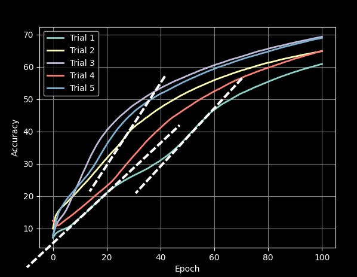

# TinyAI

## Introduction

TinyAI is an AI created from scratch, for education purposes. It's an easy task to just copy and paste premade AI code from online documentation, but the reason for this projects creation was to implimented the basic functionality of an AI neural network to gain a better understanding of how they work, at a low-level. This is not meant to compete with the speed and functionality of other neural network plugins such as [Tensorflow](www.tensorflow.org) or [PyTorch](www.pytorch.org).   

## Usage

You can test TinyAI's neural network by opening the main.py file. Here, you will find an example test utilizing the dataset brough by the [mnist](https://www.tensorflow.org/datasets/catalog/mnist) dataset. In this example, it utilizes 3 layers, however this can be easily changed to the amount of layers and neurons you desire. For custom usage, initialize a NeuralNetwork object and add Layers to it, specifying the neuron count, activation function, and alpha value. The goal was to make it as easy as possible to utilize this with only a few inputs. 

## Analysis

### The basics

Testing with a input layer of 784 (28x28 image from the mnist dataset), dense layer of 10 neurons, output dense layer of 10 neurons, learning rate of 0.1:

After only 100 epochs, the accuracy can reach greater than 72 percent confidence at identifying hand-drawn numbers from the [mnist](https://www.tensorflow.org/datasets/catalog/mnist) dataset.  
After 1000 epochs, the accuracy increases to greater than 88 percent.  

### Accuracy slopes

Interestingly, you can see some points when the neural network has a "breakthrough" where changing its weights/bias between some series of epochs, it greatly increases the accuracy. This is likely because changing these values has a great impact on many of the inputs compared to other times. One of the most promenant places to see this is in trial 1 below. Note that the slope of accuracy changes in response to hitting "sweetspots" when changing the weights/bias with respect to the input data: 

### Learning rates

One thing to note is that by changing the alpha value, we are essentially giving the nerual network a constraint on how quickly it learns. At such a low learning rate, the neural network will learn more quickly and be inefficient. However, thinking that higher = better does not hold true. Upon using a higher value, the neural network quicly increases its accuracy, but then has a sudden fall-off, as the values completely go out of range. During gradient descent, this represents the approximation changing so suddenly, it destroys the current resembelence of understanding the system. See the visual representation of different learning rates below:

 

It is important to understand that a high learning rate will be better, to some extent. You don't want to use your AI with a low learning rate because that is just simply inefficient. And you don't want to use too high of a value because that would result in the fall-offs seen above. An ideal learning rate will have a fast increasing accuracy, but not fall-off as it learns.

### Layer sizes

Layer size is also an important factor when determining the accuracy of a system over a series of epochs. Having more neurons in a dense layer will generally make it better, right?Not necesarily. When testing a system with 784 input neurons, x hidden neurons, and 10 output neurons, we will vary the hidden layers. For the trials below, 1000 epochs were recorded:

 

|Hidden layer size|Time required|
|----|----|
|5|164.064s|
|10|180.835s|
|50|309.565s|
|100|388.003s|

As seen above, the slope of the accuracy is most quickly increasing in the trial with 100 neurons and results in the highest accuracy of over 92% after 1000 epochs, however, this is also the trial that takes the longest, and requires the most amount of mathematical calculations. With the increased energy requirement and time required, there is a tradeoff to be paid for this increase in accuracy. It is user's preference for which to choose.  
Another thing to consider is that the hidden layers may not have enough neurons to give an accuracte representation of the input. For example, if the output desires 10 different options (0-9), and the hidden layer has 2 neurons, there is no way to determine 10 separate states from a linear combination of 2.

### Layer count

Similar to the layer sizes, layer count is also a varying and important factor. With layer sizes though, the learning rate will need to decrease with the layer count. The learning rate increases the sensitivity of how quickly the neural network learns, but with an increased layer count this also increases the learning rate. With both increased, it can result in the slope being too large and overshooting, resulting in a collapse of the accuracy. This has been observed when using a layer count of 3x10 hidden layers and 0.05 learning rate, which was noted to be well-below the maximum learning rate without collapse, as shown in the above section. Besides this observation, the above findings in *Layer sizes* holds true, where an increase in Layer count will also increase the amount of time, and calculations (energy) required to find a resulting model.

## Conclusion

In conclusion, TinyAI is a very useful tool for educational purposes. This was a great project to create and gain experience, and this is definitely just the tip of the iceberg with regards to neural networks. Learning more about the topics of learning rate, layer sizes, neuron counts, activation functions and more gives a better understanding of how AI functions as a whole, at a lower level surface. 