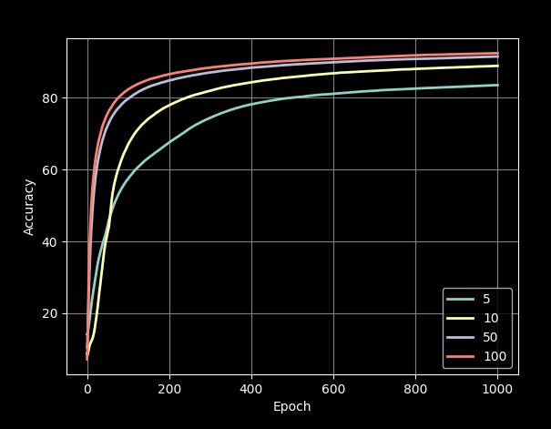

# "TinyAI" - Gradient Descent 

## Introduction

TinyAI is an AI developed from the ground up for educational purposes. Rather than relying on pre-existing AI code from online documentation, the aim of this project is to build the basic functionality of an AI neural network from scratch, in order to develop a deeper understanding of its workings at a low-level. While TinyAI is not intended to match the speed and functionality of other neural network plugins such as [Tensorflow](www.tensorflow.org) or [PyTorch](www.pytorch.org), it is worth noting that in our Analysis we show that TinyAI took 1.30 seconds to gain an accuracy of 90% when training using the mnist dataset, whereas TensorFlow took 1.43 seconds. This performance difference indicates that the simplicity of TinyAI can be beneficial. Nonetheless, TinyAI is an excellent tool for learning and understanding how neural networks work under the hood, making it a great choice for educational purposes.

## Background 

Gradient Descent is an iterative machine learning algorithm that determines the optimal values for internal weight and bias parameters. This approach is widely used in artificial intelligence, particularly when parameters cannot be calculated analytically using linear algebra. Its effectiveness lies in its efficiency and straightforward use of specified inputs and outputs. TinyAI leverages this technique to identify the optimal weights and biases that represent the output, based on the given input and neural network specifications.

## Usage

To try out the TinyAI neural network, simply open the main.py file and run the example test using the [mnist](https://www.tensorflow.org/datasets/catalog/mnist) dataset. The script uses tensorflow to download and access the mnist dataset, but if you prefer not to use tensorflow or cannot install it, you can download a version of the mnist dataset in [csv](https://github.com/sbussmann/kaggle-mnist/blob/master/Data/train.csv) format, then place it in the "res" folder and set the TENSORFLOW_DATASET variable to false in main.py. The example test currently uses a neural network with 3 layers, but you can easily customize the number of layers and neurons by creating a NeuralNetwork object and adding Layers with specific neuron counts, activation functions, and alpha values. The goal was to make it as user-friendly as possible, requiring only a few inputs for customization.

## Analysis

The analysis section will utilize the mnist dataset presented earlier to demonstrate the capabilities of TinyAI.

### Accuracy

Testing with a input layer of 784 (28x28 image from the mnist dataset), dense layer of 10 neurons, output dense layer of 10 neurons, learning rate of 0.1:

With this setup, **after each epoch**, the algorithm will re-evaluate it's values to determine a better solution. After only 100 epochs, the accuracy can reach greater than 72 percent confidence at identifying hand-drawn numbers from the mnist dataset.  
After 1000 epochs, the accuracy increases to greater than 88 percent.  

### Mean squared error

The following tests were conducted with the same specifications as the aforementioned trials, and the corresponding Mean Squared Error (MSE) values are displayed below. As is typically observed with loss graphs, the MSE begins at a high value and steadily decreases over time, with the majority of the reduction occurring between epoch marks 0 to 200. This trend is consistent with the accuracy graph displayed above. It is reasonable to expect this relationship, given that MSE is a measure of the error when comparing the calculated output to the desired output.

### Learning rates

It is important to note that by adjusting the alpha value, we are essentially placing a constraint on the speed of learning within the neural network. While a very low learning rate may enable faster learning, it can also be less efficient. Conversely, assuming that a higher value will lead to better results is not necessarily true. In fact, using a higher value may initially lead to a significant improvement in accuracy, but can also make the model more likely to overshoot the optimal solution and end up bouncing around it. This can cause the model to take longer to converge, or even prevent it from converging altogether. Please refer to the visual representation of different learning rates below:

 

It is worth noting that a higher learning rate can indeed be beneficial, up to a certain point. Using a very low learning rate can lead to inefficiencies, whereas using an excessively high value can result in the accuracy of the neural network dropping off, as demonstrated earlier. Therefore, finding an optimal learning rate that enables the neural network to achieve a fast increase in accuracy without encountering sudden drop-offs is crucial.

### Layer sizes

The size of a layer is another crucial factor that can impact the accuracy of a neural network over multiple epochs. However, it is not necessarily true that having more neurons in a dense layer will always result in better performance. As an example, consider a system with 784 input neurons, x hidden neurons, and 10 output neurons. By varying the number of hidden layers, we can evaluate the effect on the system's accuracy over 1000 epochs, as demonstrated below:

 

|Hidden layer size|Time required|
|----|----|
|5|164.064s|
|10|180.835s|
|50|309.565s|
|100|388.003s|

As shown above, the accuracy slope of the neural network increases most quickly with 100 neurons, resulting in an accuracy of over 92% after 1000 epochs. However, this trial also takes the longest and requires the most mathematical calculations, which incurs a trade-off between accuracy and resource usage. Ultimately, it is up to the user to decide which trade-off to prioritize.  
Another important factor to consider is that the hidden layers may not have sufficient neurons to accurately represent the input. For instance, if the output requires 10 distinct options (0-9), but the hidden layer only has two neurons, it is impossible to discern 10 distinct states from a linear combination of two.

### Layer count

Similarly to layer size, layer count is also a crucial factor in determining the accuracy of a neural network. However, with an increased layer count, the learning rate should decrease. The learning rate determines the sensitivity of how quickly the neural network learns, and a higher layer count can lead to an increased learning rate. If both values are increased, it can result in the slope being too steep, causing overshooting and a collapse of accuracy. This phenomenon has been observed when using a layer count of 3x10 hidden layers and a learning rate of 0.05, which was found to be well below the maximum learning rate before collapse, as noted in the above section. In addition, an increase in layer count will also increase the time and computational resources required to produce a resulting model, as demonstrated in the findings above on layer size.

### Batching the input

Batching input data is an effective way to create a faster-learning and more efficient machine learning algorithm. In the previous analysis, batch processing was not used for ease of explanation in each section. Although batching has its drawbacks, when combined with other methods, it can be used to significantly improve the long run-times observed in earlier trials. By splitting the input data into multiple batches, the neural network updates its values more frequently, allowing for faster convergence to the desired accuracy. The following trials will be conducted with the same parameters as before, but with varying batch sizes. It is worth noting that the MNIST dataset used for these trials has an input size of 60,000

 

The above results demonstrate a significant increase in accuracy when comparing a batch size of 5,000 to a batch size of 60,000, even when the epoch count remains the same. By incorporating this optimization into our algorithm, a 90% confidence level can be achieved in as few as 10 epochs using a batch size of 1,000, with a mere 1.81 seconds of computation time. This is a remarkable improvement in terms of energy efficiency and runtime, while simultaneously achieving even better accuracy than the previous trials  

However, one drawback of this method is that the algorithm may reach a point where it does not make significant progress. This can be observed by zooming in on epochs 900-1000

 

But why does the algorithm slow down? The reason is that the sets passed to the neural network in each iteration through the epoch is slightly different. Consequently, the network starts training towards those specific sets, and when it encounters the next set, the accuracy may decrease because the network's new values are not optimized for that specific set. To maintain efficiency, we can train with a low batch size until we reach high accuracy, and then switch to higher batch sizes to enable the network to resume training on the entire dataset rather than focusing on subsets. Luckily, TinyAI supports this approach!

 

In the above experiments, two different training methods were used. The first method started with a batch size of 5000 from epochs 0 to 100, and then switched to a batch size of 60000 from epochs 100 to 1000. The difference in accuracy at the 100-epoch mark, when the algorithm switched batch sizes, is evident. This approach enables the neural network to quickly improve its accuracy using a smaller batch, before transitioning to a more comprehensive training using the entire dataset. Compared to training with only a batch size of 60000, the batch sizing method improves both efficiency and accuracy.

### Comparison

In this section, I will compare the runtime and efficiency of TinyAI with one of the most popular AI platforms, TensorFlow. To perform the comparison, both platforms were configured with a neural network consisting of an input layer with 784 neurons representing the MNIST dataset, followed by a 10-neuron hidden layer, and a 10-layer output layer. Both neural networks used a learning rate of 0.1 and a batch size of 5000. In TensorFlow, the SGD optimizer was used since it is a basic algorithm similar to TinyAI. The graph below shows the runtime comparison between TinyAI and TensorFlow's implementation:

 

It is worth noting that the execution time of TinyAI and tensorflow are quite comparable. In some trials, TinyAI outperforms tensorflow while in others, tensorflow performs better. The comparison was conducted over 10 trials, and on average, TinyAI had a slightly faster execution time. It is possible that certain settings or configurations in tensorflow could have made it more efficient, which were not utilized during this comparison. When utilizing other optimizers such as the Adam optimizer with a 0.01 learning rate, the execution time for tensorflow decreases significantly to 0.67s. Hence, the previous graph does not provide a completely fair comparison of the maximum efficiency of both AI's. Despite this, considering the simplicity of the TinyAI implementation, its competitive performance is impressive.

## Conclusion

In summary, TinyAI is a valuable resource for educational purposes, providing a practical way to gain experience in the field of neural networks. This project represents just a fraction of what can be achieved with AI, and by exploring topics such as learning rate, layer sizes, neuron counts, and activation functions, one can gain a deeper understanding of how AI functions at a fundamental level. Overall, TinyAI is an excellent tool to follow along with for anyone interested in learning more about artificial intelligence.